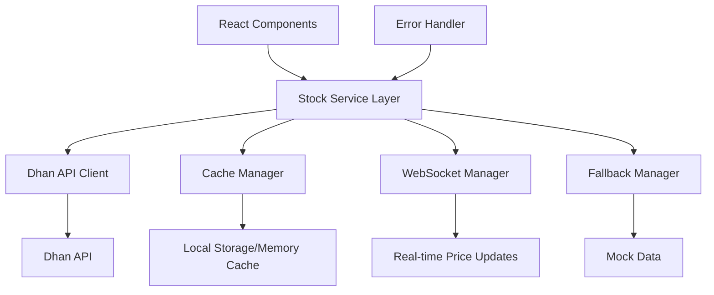
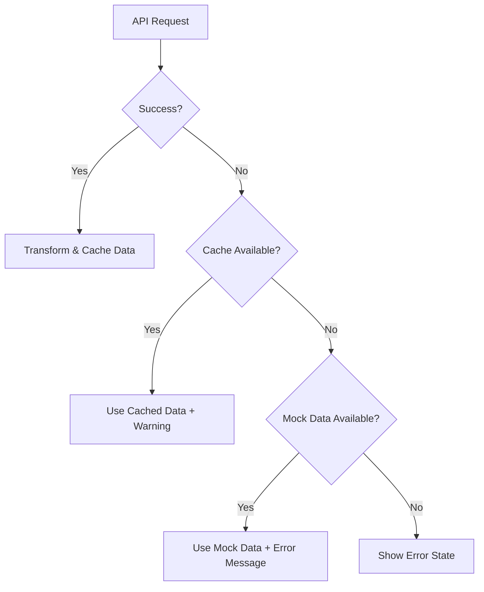

# Design Document

## Overview

This design outlines the integration of real-time stock data using the Dhan API to replace the current mock data system. The solution will maintain backward compatibility with existing components while providing live market data through a robust, scalable architecture.

## Architecture

### High-Level Architecture



### Data Flow

1. **Initial Load**: Components request stock data → Stock Service checks cache → If cache miss, fetch from Dhan API → Transform and cache data → Return to components
2. **Real-time Updates**: WebSocket connection receives price updates → Transform data → Update cache → Notify subscribers
3. **Error Handling**: API failures trigger fallback to cached data or mock data with appropriate user notifications

## Components and Interfaces

### Core Services

#### 1. DhanApiClient
```typescript
interface DhanApiClient {
  authenticate(): Promise<boolean>;
  getStockQuotes(symbols: string[]): Promise<DhanStockData[]>;
  getHistoricalData(symbol: string, timeframe: string): Promise<DhanHistoricalData>;
  subscribeToRealTimeUpdates(symbols: string[], callback: (data: DhanStockData[]) => void): () => void;
}
```

#### 2. StockService
```typescript
interface StockService {
  getStocks(): Promise<Stock[]>;
  getStock(symbol: string): Promise<Stock>;
  subscribeToUpdates(callback: (stocks: Stock[]) => void): () => void;
  getChartData(symbol: string, timeframe: '1D' | '1W' | '1M'): Promise<ChartData>;
}
```

#### 3. CacheManager
```typescript
interface CacheManager {
  get<T>(key: string): T | null;
  set<T>(key: string, value: T, ttl?: number): void;
  invalidate(key: string): void;
  clear(): void;
}
```

### Data Models

#### Dhan API Response Models
```typescript
interface DhanStockData {
  tradingSymbol: string;
  exchangeSegment: string;
  lastPrice: number;
  change: number;
  changePercent: number;
  volume: number;
  // Additional Dhan-specific fields
}

interface DhanHistoricalData {
  symbol: string;
  data: Array<{
    timestamp: string;
    open: number;
    high: number;
    low: number;
    close: number;
    volume: number;
  }>;
}
```

#### Transformed Models (Existing)
```typescript
interface Stock {
  symbol: string;
  name: string;
  fullName: string;
  price: number;
  change: number;
  changePercent: number;
  volume: string;
  description: string;
}
```

## Error Handling

### Error Types and Responses

1. **Authentication Errors**
   - Invalid API credentials → Show error message, fallback to mock data
   - Token expiration → Attempt re-authentication, fallback on failure

2. **Network Errors**
   - Connection timeout → Retry with exponential backoff, use cached data
   - Rate limiting → Implement queue with appropriate delays

3. **Data Errors**
   - Invalid response format → Log error, use last known good data
   - Missing stock data → Show "Data unavailable" for specific stocks

### Fallback Strategy



## Testing Strategy

### Unit Tests
- **DhanApiClient**: Mock API responses, test authentication, data transformation
- **StockService**: Test caching logic, fallback mechanisms, data aggregation
- **CacheManager**: Test TTL, invalidation, memory management

### Integration Tests
- **API Integration**: Test actual Dhan API calls with test credentials
- **WebSocket Connection**: Test real-time update handling and reconnection
- **End-to-End Data Flow**: Test complete data flow from API to UI components

### Performance Tests
- **Load Testing**: Test with multiple concurrent API calls
- **Memory Usage**: Monitor cache size and cleanup
- **Response Times**: Ensure API calls don't block UI

## Implementation Phases

### Phase 1: Core API Integration
- Set up Dhan API client with authentication
- Implement basic stock data fetching
- Create data transformation layer
- Add error handling and logging

### Phase 2: Caching and Performance
- Implement cache manager with TTL
- Add request batching and throttling
- Optimize data transformation
- Add performance monitoring

### Phase 3: Real-time Updates
- Implement WebSocket connection for live updates
- Add subscription management
- Handle connection failures and reconnection
- Optimize update frequency

### Phase 4: Enhanced Features
- Add historical data for charts
- Implement advanced error recovery
- Add configuration management
- Performance optimizations

## Configuration

### Environment Variables
```
DHAN_API_BASE_URL=https://api.dhan.co
DHAN_API_KEY=your_api_key
DHAN_CLIENT_ID=your_client_id
DHAN_ACCESS_TOKEN=your_access_token
CACHE_TTL_SECONDS=30
WEBSOCKET_RECONNECT_INTERVAL=5000
FALLBACK_TO_MOCK=true
```

### API Rate Limits
- Respect Dhan API rate limits (typically 100 requests/minute)
- Implement request queuing and throttling
- Use WebSocket for real-time updates to reduce API calls

## Security Considerations

1. **API Credentials**: Store in environment variables, never in code
2. **Request Validation**: Validate all API responses before processing
3. **Error Logging**: Log errors without exposing sensitive information
4. **CORS**: Ensure proper CORS configuration for API calls
5. **Token Management**: Implement secure token refresh mechanisms